# Puzzle Solver using Informed AI - A* Algorithm

This project contains an implementation of the A* algorithm applied to solve the classic 8-Puzzle problem. 

## Features
<ul>
<li><b>Heuristic-driven Optimization:</b> A* intelligently explores possible solutions by considering both the actual cost and a heuristic estimate.

<li><b>Versatility:</b> Solve the 8-Puzzle problem with either numbers or images, showcasing the adaptability of the AI algorithm.

<li><b>Visual Representation:</b> Visualize the steps taken to solve image-based puzzles, with an option to save the intermediate results.
</ul>


### Pre-requisites
<ul>
  <li> Python 3.x</li>
  <li> OpenCV </li>
</ul>

### Installation
<b>1. Clone the repository:</b>
```bash
git clone https://github.com/yourusername/AI-Puzzle-Solver.git
```

<b>2. Navigate to Project Directory:</b>
<br>cd AI-Puzzle-Solver

<b>3. Install dependencies</b>
```bash
pip install opencv-python
```

```bash
pip install numpy
```

### Usage
Run the 'main.py' file:
<be>
```bash
python main.py
```
Select Between Numbered Sliding Puzzle and Sliding Puzzle from an Image. 

If you chose numbered sliding puzzle, you can input a randomized sequence of number for 8-Puzzle. 
For eg.
|      |      |      |
|------|------|------|
| 1    | 2    | 3    |
| _    | 4    | 6    |
| 7    | 5    | 8    |

and after providing the input, you will be prompter to provide goal state, which for this case ideally would be

|      |      |      |
|------|------|------|
| 1    | 2    | 3    |
| 4    | 5    | 6    |
| 7    | 8    | _    |

The A* algorithm uses a combination of the actual cost to reach a node (g) and a heuristic estimate of the remaining cost to the goal (h). 

The total cost (f) is given by:
<br> f(x) = g(x) + h(x)

In the context of the 8-Puzzle, the heuristic function 'h(x)' calculates the number of misplaced tiles between the current state and the goal state.

Here is an representation for working of A* Algo on numbered puzzle:


If you happen to select the image puzzle, you will be prompted to provide the path of the image. You can create jumbled image puzzle by providing sequence.

For eg:
Input image:


Jumbled image using user input:
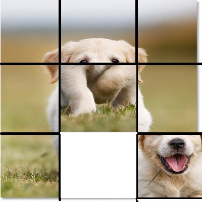

Algo will solve for goal state:
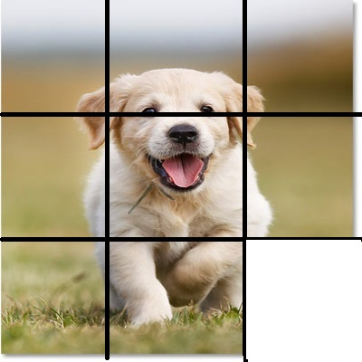


## Results
<div style="display: flex; flex-direction: row; justify-content: center; gap: 30px;">
    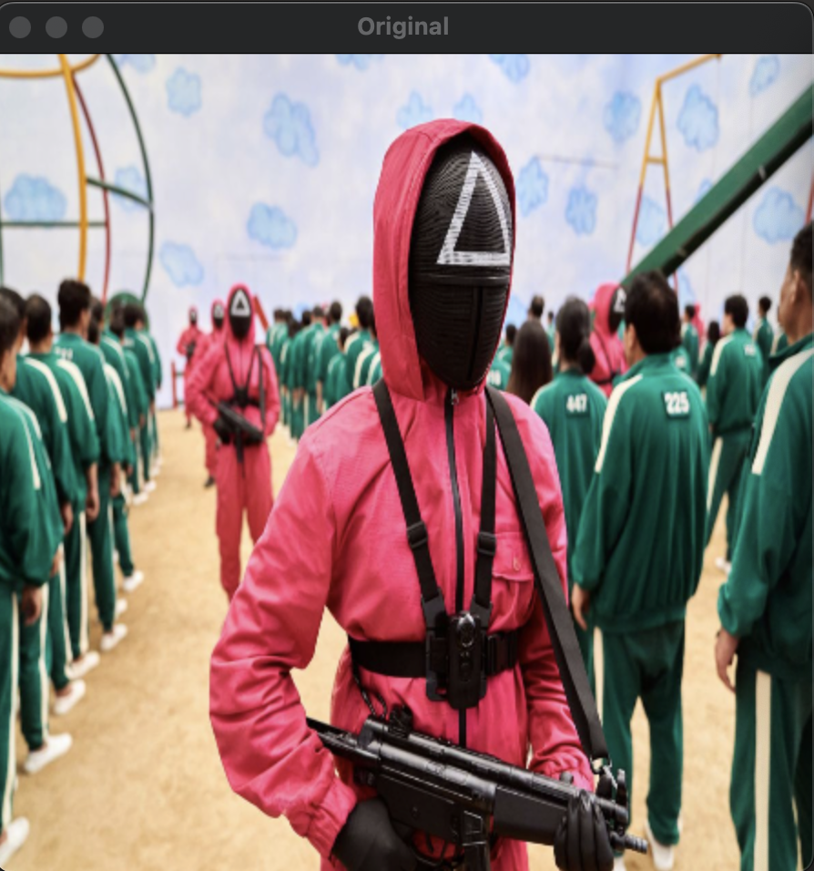
    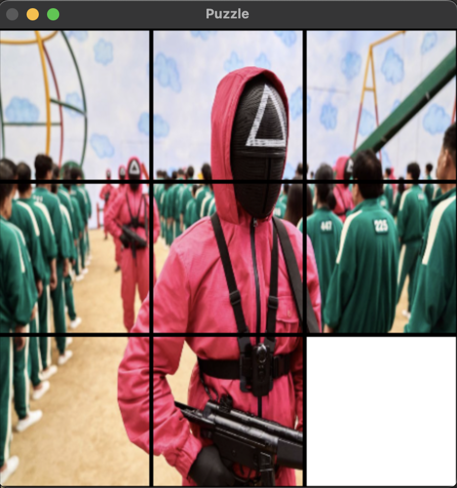
</div>
<p align="center">Input & Jumbled Image</p>

**Solving:**
<div style="display: flex; flex-direction: row; justify-content: center; gap: 20px;">
  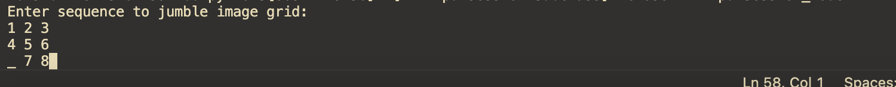
  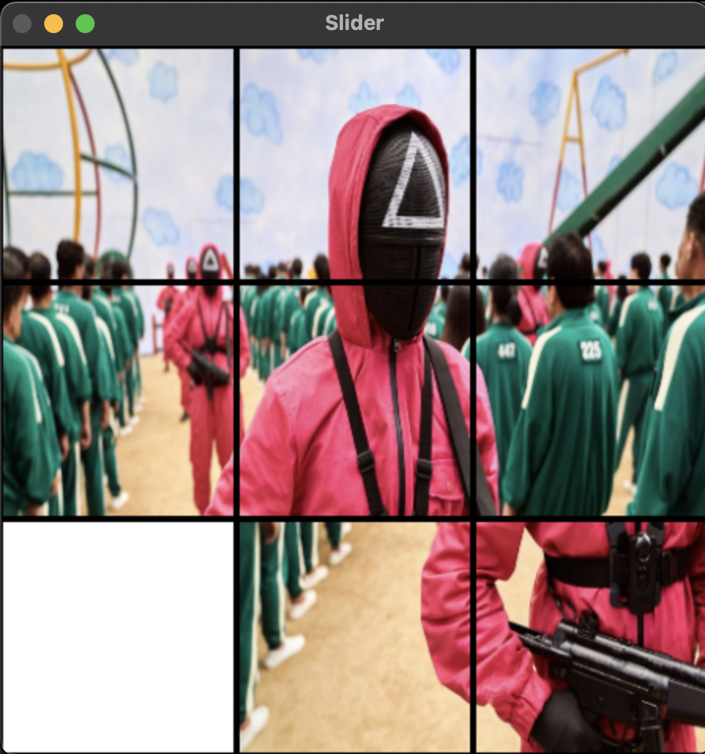
</div>
<p align="center"><em>Step 1</em></p>

<div style="display: flex; flex-direction: row; justify-content: center; gap: 20px;">
  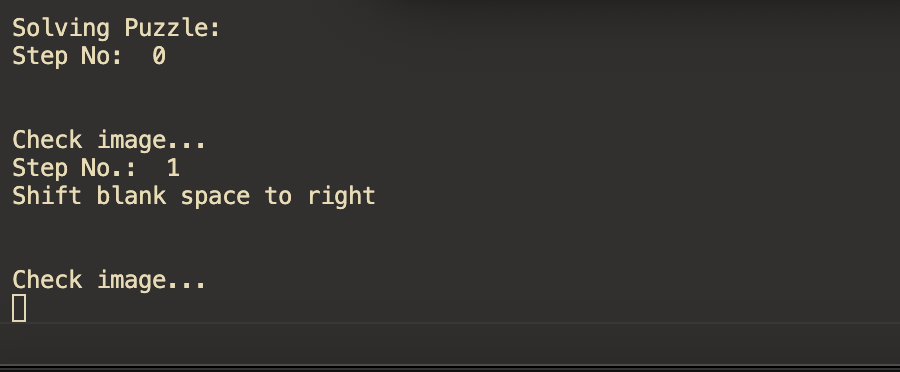
  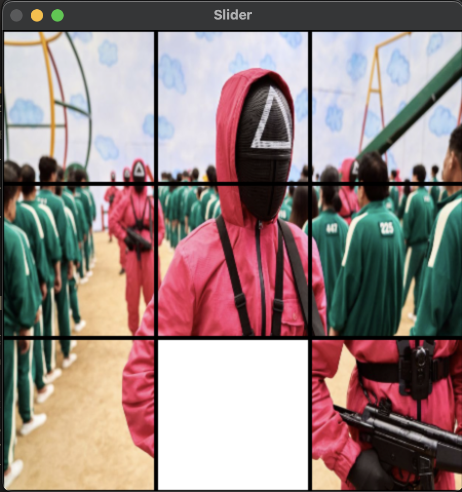
</div>
<p align="center"><em>Step 2</em></p>

<div style="display: flex; flex-direction: row; justify-content: center; gap: 20px;">
  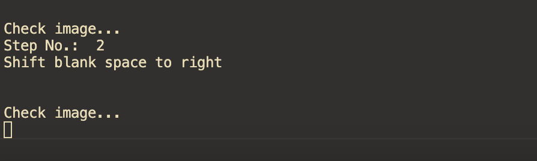
  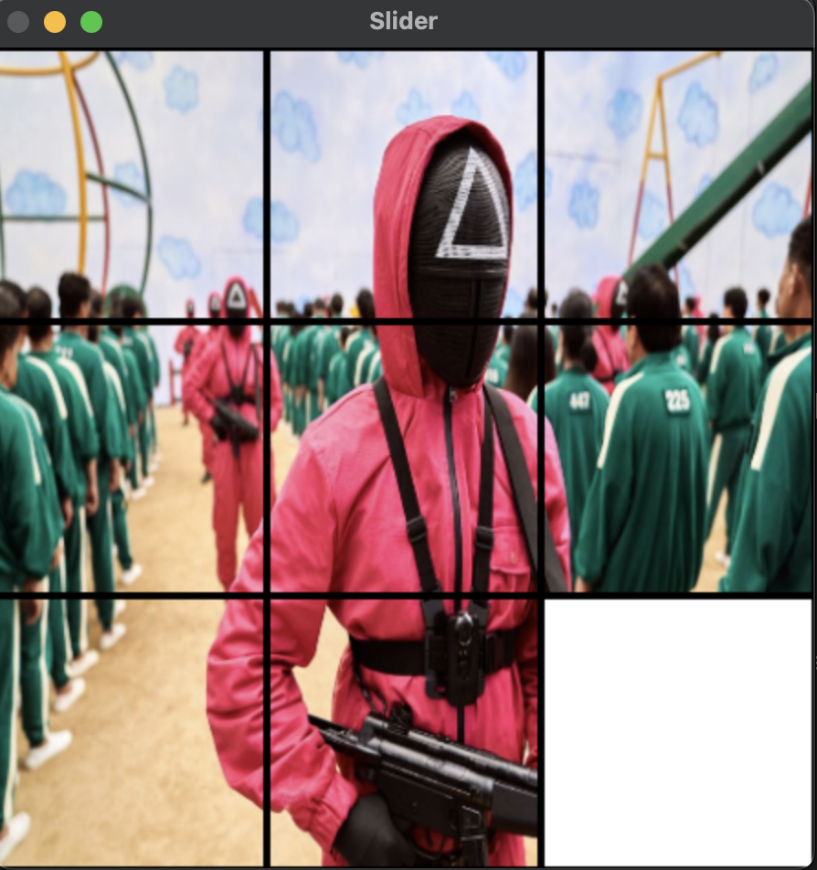
</div>
<p align="center"><em>Step 3</em></p>

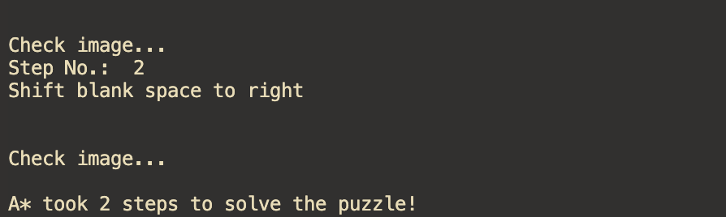
